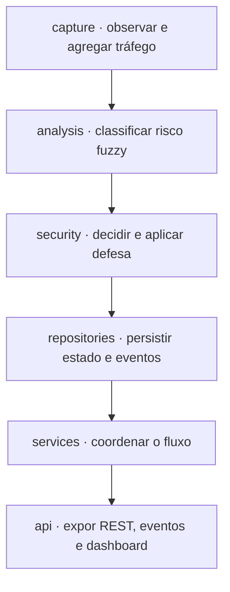

# NetSentinel — arquitetura e padrões de projeto

Referência: implementação 0.7.0. Este documento atende ao requisito NEXUS de
arquitetura documentada com padrões aplicados e justificados. A rastreabilidade
dos cinco requisitos e seus estados está em [compliance.md](../compliance.md).

## Visão textual das camadas

**capture → analysis → security → repositories → services → api**

Essa é a ordem de leitura das responsabilidades, não uma declaração de cadeia
unidirecional de imports ou de execução. **services coordena as demais partes**;
repositories também é consultado durante a análise e recebe o snapshot antes da
classificação. A seção seguinte explicita a ordem real para evitar que o diagrama
sugira que persistência e coordenação só ocorrem depois da defesa.

| Camada | Responsabilidade e localização | Limite de responsabilidade |
| --- | --- | --- |
| capture | [CaptureService](../../src/netsentinel/capture/service.py), [ScapySource](../../src/netsentinel/capture/scapy_source.py), [normalizer](../../src/netsentinel/capture/normalizer.py) e [ObservationWindow](../../src/netsentinel/capture/window.py): observações Ethernet/ARP, agregação e qualidade da janela. | Não atribui confiança ao MAC alegado no ARP e não aplica firewall. |
| analysis | [FeatureExtractor](../../src/netsentinel/analysis/features.py) e [FuzzyRiskStrategy](../../src/netsentinel/analysis/fuzzy/engine.py): inputs, pertinências, regras Mamdani e score por dispositivo. | Não abre conexão SQL nem executa defesa. Inputs ausentes não viram valores baixos inventados. |
| security | [SecurityIdentity](../../src/netsentinel/security/identity.py), [SecurityDemo](../../src/netsentinel/security/demo.py), [MitigationStrategy](../../src/netsentinel/security/strategy.py), [agente](../../src/netsentinel/security/agent/) e [verify_interval](../../src/netsentinel/security/evidence.py): `trusted_bindings()`, detecção ampla, sequência por MAC, defesa só do MAC pré-aprovado e evidência. | Score alto sozinho não autoriza mitigação; o Sensor não executa o firewall da Vítima. |
| repositories | [Repository](../../src/netsentinel/repositories/store.py), [models](../../src/netsentinel/repositories/models.py), [Database](../../src/netsentinel/repositories/database.py) e [migrações](../../migrations/): dispositivos, reputação, baseline, auditoria, eventos, `risk_history()` e `prune_events()`. | Persistir presença não promove automaticamente NEW para KNOWN. |
| services | [BackendPipeline](../../src/netsentinel/services/pipeline.py), [SourceRunner](../../src/netsentinel/services/runner.py) e [fonte sintética](../../src/netsentinel/services/synthetic.py): compõem dependências e coordenam uma fonte por processo. | Fonte de laboratório e fonte sintética não são conectadas entre si. |
| api | [create_app](../../src/netsentinel/api/app.py), [entrypoint local](../../src/netsentinel/api/__main__.py), [WSGI](../../src/netsentinel/api/wsgi.py), [template](../../src/netsentinel/api/templates/dashboard.html) e [frontend](../../src/netsentinel/api/static/dashboard.mjs): sessão/CSRF, REST (inclui `GET /api/devices/<mac>/history`), Socket.IO, CSP e subcomando `prune`. | A interface apresenta scores/evidências recebidos; não captura tráfego nem envia comandos arbitrários ao agente. |

Módulos de apoio: [domain/observation.py](../../src/netsentinel/domain/observation.py)
representa a observação normalizada; [events/bus.py](../../src/netsentinel/events/bus.py)
fornece o Observer em processo. Não constituem serviços remotos adicionais.

## Ordem real de execução

1. `api.create_app` seleciona configurações, Repository, EventBus e estratégia de
   mitigação, compondo `BackendPipeline`. Criar a app não inicia captura. O comando
   `serve` ou a factory WSGI inicia explicitamente `SourceRunner`.
2. Em laboratório, `SourceRunner` verifica condições locais e conecta
   `CaptureService.publish` a `BackendPipeline.consume`. No ambiente sintético,
   `SyntheticSource` fornece snapshots artificiais ao mesmo pipeline.
3. `BackendPipeline.consume` valida a origem do snapshot e persiste dispositivos e
   último snapshot via Repository. MAC novo permanece NEW. Em seguida chama
   `SecurityDemo.consume`, cujo classificador consulta os providers persistidos
   de reputação e baseline e calcula risco.
4. `SecurityDemo` publica `risk_evaluated` para todo `results`. Ameaça confirmada
   é score >=65 com falsificação de um IP em `SecurityIdentity.trusted_bindings()`.
   Só o MAC de `attacker_mac` segue a sequência ADR 0007 e chama a estratégia;
   qualquer outro MAC confirmado emite `threat_unmitigable` (ADR 0008). A execução
   real ocorre no agente da Vítima; a estratégia sintética não o contata.
5. Após a classificação/defesa, o pipeline coleta amostras de calibração elegíveis.
   Assim, a quinta janela não é classificada contra um baseline que acaba de
   incorporá-la. Publica `baseline_calibrated`, se aplicável, e `snapshot_updated`.
6. Cada `BackendPipeline.publish` persiste o evento, obtém seu `event_id` e então
   chama EventBus. O assinante da API entrega o evento aos clientes Socket.IO
   autenticados. REST permite consultar estado e recuperar histórico perdido.

O fluxo é síncrono dentro da coordenação do pipeline; não se declara uma transação
única que englobe banco e ação remota do firewall. Locks em processo e uma Session
SQLAlchemy por operação controlam concorrência no MVP, sem transformar a aplicação
em um sistema distribuído com entrega exatamente uma vez.

## Observer — eventos sem acoplar produtores ao dashboard

**Por que foi escolhido:** captura, análise e defesa precisam produzir eventos
sem conhecer conexão de navegador, sessão do operador ou transporte Socket.IO.
O Observer permite acrescentar/remover consumidores mantendo esse limite.

**Onde está aplicado:** `EventBus.subscribe(callback)` registra assinantes e
retorna uma função de remoção; `publish(event)` notifica callbacks. A API registra
`notify` com `bus.subscribe(notify)` em [app.py](../../src/netsentinel/api/app.py).
O pipeline conhece o barramento; não emite diretamente para sockets de navegador.

Eventos incluem `risk_evaluated`, `threat_unmitigable`, `mitigation_applied`,
`mitigation_status`, `mitigation_error`, `reputation_changed`,
`baseline_calibrated`, `snapshot_updated` e `source_error`. O barramento é local
ao processo; Socket.IO transporta as
notificações até o browser. São papéis complementares, não o mesmo componente.

**Evidência:** [test_backend.py](../../tests/integration/test_backend.py),
`BackendTests.test_websocket_requires_session_and_csrf_then_receives_persisted_events`,
exercita persistência e entrega autenticada pelo cliente de teste Socket.IO.
No frontend, [core.mjs](../../src/netsentinel/api/static/core.mjs), `EventFeed`,
recupera eventos por REST sem avançar o cursor apenas por receber um ID maior no
socket; [core.test.mjs](../../frontend/tests/core.test.mjs) cobre a lacuna e a deduplicação.

**Limite:** EventBus não é fila durável nem broker distribuído. A persistência
anterior à notificação permite replay; não garante entrega ao vivo quando o
assinante falha. A falha de um callback é registrada sem impedir os demais.

## Strategy — algoritmo e mecanismo de defesa substituíveis

**Por que foi escolhido:** o coordenador deve depender de operações de
classificação/mitigação, sem incorporar detalhes do Mamdani, HTTP ou firewall.
Isso permite testar o fluxo e executar o ambiente sintético com contratos estáveis.

**Onde está aplicado:**

| Contrato | Implementação | Composição |
| --- | --- | --- |
| `ClassificationStrategy.classify(snapshot)` em [analysis/contracts.py](../../src/netsentinel/analysis/contracts.py) | `FuzzyRiskStrategy`, em [fuzzy/engine.py](../../src/netsentinel/analysis/fuzzy/engine.py). Conformidade estrutural via Protocol, sem herança obrigatória. | `BackendPipeline` constrói o fuzzy com providers Repository e o injeta em `SecurityDemo`. Não há seletor de múltiplos algoritmos na configuração atual. |
| `MitigationStrategy.apply(mac)` e `status()` em [security/strategy.py](../../src/netsentinel/security/strategy.py) | `VictimAgentMitigationStrategy` no laboratório; `SyntheticMitigation` em [services/synthetic.py](../../src/netsentinel/services/synthetic.py) no ambiente artificial. | `api.create_app` escolhe a estratégia por ambiente e a entrega ao pipeline; `SecurityDemo` usa apenas as operações do contrato. |

`ReputationProvider` e `BaselineProvider` também são dependências injetadas por
contrato. Essa injeção permite testar ausência/falha de histórico sem colocar SQL
no motor; não representa aprendizado automático ou GA já implementado.
`SecurityIdentity` (`attacker_mac` + `trusted_bindings()`) é o contrato que
separa inventário confiável da autorização de mitigação.

**Evidência:** `FeatureTests.test_replacing_provider_changes_classification`, em
[test_fuzzy.py](../../tests/unit/test_fuzzy.py), verifica substituição de provider;
`BackendTests.test_cloud_uses_secure_cookie_and_never_constructs_real_agent`, em
[test_backend.py](../../tests/integration/test_backend.py), verifica a separação
entre mitigação sintética e agente real. A integração
`test_pcap_to_repository_strategy_agent_and_websocket` exercita a composição completa offline.

**Limite:** o fuzzy é a única estratégia de classificação de produção hoje.
Troca futura por outro algoritmo exige implementar/testar seu contrato; o padrão
não comprova que GA ou qualquer alternativa já exista. A política de duas avaliações
fica em `SecurityDemo`, não é reimplementada pelas estratégias de transporte.

## Repository — persistência fora do motor de análise

**Por que foi escolhido:** reputação, baseline e histórico precisam sobreviver ao
processo, mas análise e defesa não devem conhecer queries ou diferenças entre
SQLite e Postgres. Concentrar o acesso permite manter as regras de histórico,
auditoria e calibração coerentes.

**Onde está aplicado:** [store.py](../../src/netsentinel/repositories/store.py),
`Repository`, expõe operações como `get_reputation`, `get_baseline_bps`,
`save_snapshot`, `change_reputation`, `collect_calibration`, `append_event`,
`events`, `risk_history` e `prune_events`. [database.py](../../src/netsentinel/repositories/database.py) gerencia
engine, sessões e transações; [models.py](../../src/netsentinel/repositories/models.py)
define as tabelas. [Alembic](../../migrations/) versiona o schema.
O mesmo Repository SQLAlchemy recebe a URL do banco; não existem duas classes de
Repository independentes, uma para cada banco.

Para o fuzzy, MAC ausente após consulta bem-sucedida é NEW; falha do provider é
UNKNOWN. KNOWN exige reconhecimento explícito. O baseline é a mediana congelada
de cinco janelas completas sem sobreposição/conflito, em **bytes/s**, para KNOWN.
Mediana zero é indisponível. Ver [ADR 0004](../decisions/0004-promocao-manual-de-reputacao.md)
e [ADR 0005](../decisions/0005-baseline-persistido-e-migracoes.md).

**Evidência:** [test_repository.py](../../tests/unit/test_repository.py),
`RepositoryTests.test_new_stays_new_after_persisting_and_restart`,
`test_provider_failure_is_unknown_not_new` e
`test_baseline_converts_each_window_bytes_to_bytes_per_second` exercitam persistência,
semântica de reputação e unidade de calibração.

**Limite:** os testes executados usam SQLite real e SQL PostgreSQL compilado offline.
Compatibilidade com Postgres em execução ainda precisa ser demonstrada. Repository
isola detalhes SQL dos consumidores, mas não torna gratuita uma mudança de schema
ou de tecnologia de banco.

## Fronteiras de execução e limites conhecidos

No laboratório, Sensor acumula backend/dashboard e captura. Sua Internal Network
é usada para observar o segmento e chamar o agente; Host-only atende somente o
notebook. Atacante, Vítima e Gateway não recebem uplink. O agente na Vítima exige
peer interno/token, executa ações fixas e tem CAP_NET_ADMIN; o backend não recebe
poder para enviar comandos arbitrários. Ver [ADR 0003](../decisions/0003-agente-e-acesso-hostonly.md)
e [lab/README.md](../../lab/README.md).

No ambiente sintético, não se abre captura real nem conexão com a Vítima. O
[Compose](../../docker-compose.yml) proposto roda localmente no Docker Desktop;
[Dockerfile](../../Dockerfile) não comprova publicação em Cloud Run. Migração em
Postgres real, build/execução da imagem, deploy cloud e browser/VMs ainda dependem
de validação. Operação atual exige um worker/uma instância por ambiente.

[ADR 0006](../decisions/0006-duplicacao-da-verificacao-de-evidencia.md) registra a
regra de evidência duplicada em Python e JavaScript: a emenda 0.7.0 rejeita o
endpoint e impede divergência via corpus compartilhado.
[ADR 0007](../decisions/0007-duas-avaliacoes-antes-da-mitigacao.md) registra as duas
avaliações consecutivas, sem promessa de atraso fixo nem de janelas independentes.
[ADR 0008](../decisions/0008-deteccao-ampla-mitigacao-restrita.md) registra detecção
ampla e mitigação restrita.

A API expõe `GET /api/devices/<mac>/history` (série `risk_evaluated` persistida;
default 100, teto 500). A poda da tabela `events` é o subcomando
`python -m netsentinel.api prune --keep-days DIAS [--confirm]`: dry-run conta,
`--confirm` apaga e audita. O MAC reservado `02:00:00:00:00:00` satisfaz a FK
de auditoria, não aparece em `devices()` e `change_reputation` o rejeita.
