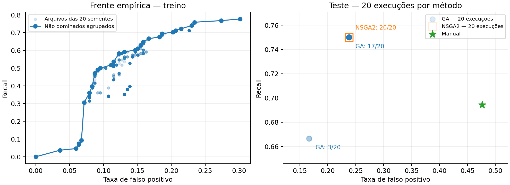

# Comparação experimental — dados exclusivamente sintéticos

O teste reservado não participa da busca nem da escolha de representantes.

| Método | Precisão | Recall | F1 | FPR | Abstenções |
|---|---:|---:|---:|---:|---:|
| Manual (determinístico) | 0.3846 | 0.6944 | 0.4950 | 0.4762 | 14.0000 |
| ga (20 sementes) | 0.5830 ± 0.0209 | 0.7375 ± 0.0305 | 0.6503 ± 0.0007 | 0.2274 ± 0.0262 | 14.0000 ± 0.0000 |
| nsga2 (20 sementes) | 0.5745 ± 0.0000 | 0.7500 ± 0.0000 | 0.6506 ± 0.0000 | 0.2381 ± 0.0000 | 14.0000 ± 0.0000 |

Valores: média ± desvio-padrão amostral (ddof=1). O baseline é uma única execução determinística; a variação dos métodos mede somente aleatoriedade da busca neste split, não incerteza de generalização.

Neste split sintético, ambos os métodos obtiveram F1 médio maior que o manual.

A frente agrupada contém 29 pontos objetivos distintos. As ligações no gráfico são guias visuais, não soluções intermediárias garantidas.

O painel de teste plota as 20 execuções individuais de cada método, com transparência alpha=0,14, sem jitter. Círculos azuis representam AG e quadrados laranja vazados representam NSGA-II. Pontos coincidentes se sobrepõem; os rótulos informam quantas sementes ocupam cada ponto. O painel não mostra médias nem barras de erro; média e desvio-padrão permanecem na tabela.

Não há garantia de superioridade sobre o manual. Sobreposição entre famílias benignas e ataques limita a separação pelas quatro features. Resultados não constituem validação em tráfego real ou nas VMs. Nenhuma configuração é promovida automaticamente à aplicação.

Tempo total de otimização/avaliação: 195.8 s.
Dados, hashes de PCAP, sementes, parâmetros individuais, versões e arquivos de treino completos estão em dataset/dataset.json e results.json.

## Genótipos e decisões observadas

Verificação dos genes crus em `results.json`: 20 genótipos distintos em 20 execuções do NSGA-II. A saturação de frequência varia de 1.88874430 a 13.69610127 anúncios/s (aproximadamente 1.89–13.70).

| Método | Execuções | TP | FP | FN | TN | Sementes |
|---|---:|---:|---:|---:|---:|---|
| GA | 17/20 | 27 | 20 | 9 | 64 | 0, 1, 2, 3, 4, 5, 7, 8, 9, 10, 11, 12, 13, 15, 16, 18, 19 |
| GA | 3/20 | 24 | 14 | 12 | 70 | 6, 14, 17 |
| NSGA2 | 20/20 | 27 | 20 | 9 | 64 | 0, 1, 2, 3, 4, 5, 6, 7, 8, 9, 10, 11, 12, 13, 14, 15, 16, 17, 18, 19 |

A comparação exemplo a exemplo encontrou 1 vetor(es) distinto(s) de decisões binárias nas execuções do NSGA-II.

Os 20 genótipos comprovadamente distintos do NSGA-II convergem para a mesma matriz de confusão no conjunto de teste. Isso é evidência de um platô do comportamento de decisão avaliado nesse conjunto, não de convergência genética. Não demonstra que os scores contínuos sejam iguais ou que as decisões coincidam em dados fora do teste.

A divisão do AG entre os pontos listados acima explica seu desvio-padrão pequeno, mas não zero nesta execução.
