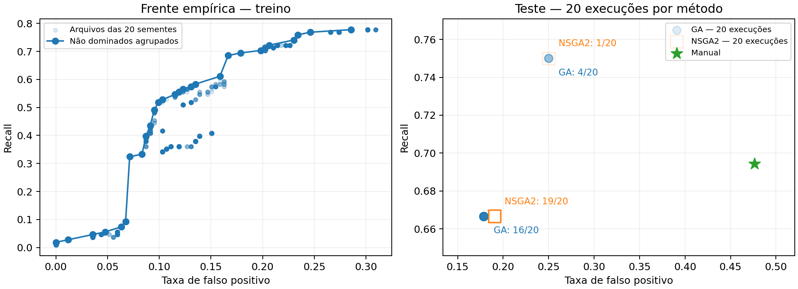

# Comparação experimental — dados exclusivamente sintéticos

Baseline: fuzzy manual 0.7.0. Ratio ARP usa rampa fixa 0,5–1,0; quatro genes são otimizados. O teste reservado não participa da busca nem da escolha de representantes.

Corpus v2: requests e replies ARP reais em PCAPs sintéticos; ratio extraído pelo capturador. A verificação de variação e sensibilidade precedeu a decisão de manter o piso fixo (ADR 0011). As comparações anteriores estão invalidadas e preservadas em ../historical-invalid/.

| Método | Precisão | Recall | F1 | FPR | Abstenções |
|---|---:|---:|---:|---:|---:|
| Manual (determinístico) | 0.3846 | 0.6944 | 0.4950 | 0.4762 | 14.0000 |
| ga (20 sementes) | 0.6048 ± 0.0217 | 0.6833 ± 0.0342 | 0.6406 ± 0.0012 | 0.1929 ± 0.0293 | 14.0000 ± 0.0000 |
| nsga2 (20 sementes) | 0.5981 ± 0.0084 | 0.6708 ± 0.0186 | 0.6321 ± 0.0025 | 0.1935 ± 0.0133 | 14.0000 ± 0.0000 |

Valores: média ± desvio-padrão amostral (ddof=1). O baseline é uma única execução determinística; a variação dos métodos mede somente aleatoriedade da busca neste split, não incerteza de generalização.

Neste split sintético, ambos os métodos obtiveram F1 médio maior que o manual.

A frente agrupada contém 28 pontos objetivos distintos. As ligações no gráfico são guias visuais, não soluções intermediárias garantidas.

O painel de teste plota as 20 execuções individuais de cada método, com transparência alpha=0,14, sem jitter. Círculos azuis representam AG e quadrados laranja vazados representam NSGA-II. Pontos coincidentes se sobrepõem; os rótulos informam quantas sementes ocupam cada ponto. O painel não mostra médias nem barras de erro; média e desvio-padrão permanecem na tabela.

Não há garantia de superioridade sobre o manual. Sobreposição entre famílias benignas e ataques limita a separação pelas cinco entradas. Resultados não constituem validação em tráfego real ou nas VMs. Nenhuma configuração é promovida automaticamente à aplicação.

Tempo total de otimização/avaliação: 279.7 s.
Dados, hashes de PCAP, sementes, parâmetros individuais, versões e arquivos de treino completos estão em dataset/dataset.json e results.json.

GA: a redução média de falsos positivos vem acompanhada de recall médio menor que o manual. F1 maior não significa superioridade em todas as métricas.

NSGA2: a redução média de falsos positivos vem acompanhada de recall médio menor que o manual. F1 maior não significa superioridade em todas as métricas.

## Validade e cobertura do corpus

Ratio: 219 valores distintos; 575/600 cenários com requests. Distribuição por classe e família em diagnostics.json.

Sensibilidade no treino, entre os extremos de cada gene e demais parâmetros manuais (não são métricas de desempenho):

| Gene | Scores alterados | Decisões binárias alteradas |
|---|---:|---:|
| conflict | 114 | 38 |
| frequency | 199 | 43 |
| deviation | 77 | 28 |
| upper | 0 | 274 |

Ativação de regras no treino: R1=114, R2=163, R3=155, R4=0, R5=77.

NEW sem baseline não confirma desvio baixo: R4 permanece inativa por ausência de histórico, não por ratio saturado.

A comparação exercita R1/R2/R3/R5; não comprova eficácia empírica de R4. O piso 0,5 foi mantido como controle da 0.7.0, não demonstrado ótimo.

## Genótipos e decisões observadas

Verificação dos genes crus em `results.json`: 20 genótipos distintos em 20 execuções do NSGA-II. A saturação de frequência varia de 2.45903171 a 19.90283917 anúncios/s (aproximadamente 2.46–19.90).

| Método | Execuções | TP | FP | FN | TN | Sementes |
|---|---:|---:|---:|---:|---:|---|
| GA | 16/20 | 24 | 15 | 12 | 69 | 0, 1, 2, 3, 5, 6, 7, 8, 9, 11, 13, 14, 15, 16, 17, 18 |
| GA | 4/20 | 27 | 21 | 9 | 63 | 4, 10, 12, 19 |
| NSGA2 | 19/20 | 24 | 16 | 12 | 68 | 0, 1, 2, 3, 4, 5, 6, 7, 8, 9, 10, 11, 13, 14, 15, 16, 17, 18, 19 |
| NSGA2 | 1/20 | 27 | 21 | 9 | 63 | 12 |

A comparação exemplo a exemplo encontrou 2 vetor(es) distinto(s) de decisões binárias nas execuções do NSGA-II.

O AG ocupa 2 grupo(s) de matriz de confusão; o desvio-padrão amostral de F1 é 0.00117255.
