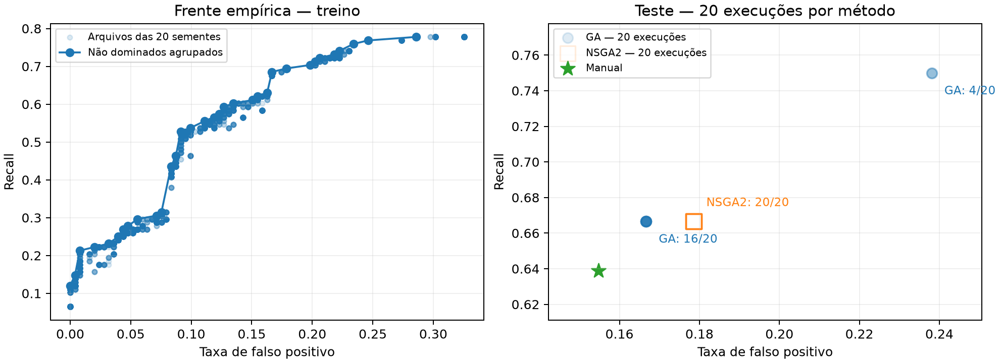

# Comparação experimental — dados exclusivamente sintéticos

Baseline: fuzzy manual 0.7.0+adr0013. Ratio ARP usa rampa fixa 0,5–1,0; quatro genes são otimizados. O teste reservado não participa da busca nem da escolha de representantes.

Corpus v3 (modelo da ADR 0013): requests e replies ARP reais em PCAPs sintéticos; ratio extraído pelo capturador. A verificação de variação e sensibilidade precedeu a decisão de manter o piso fixo (ADR 0011). As comparações anteriores estão invalidadas e preservadas em ../historical-invalid/.

| Método | Precisão | Recall | F1 | FPR | Abstenções |
|---|---:|---:|---:|---:|---:|
| Manual (determinístico) | 0.6389 | 0.6389 | 0.6389 | 0.1548 | 14.0000 |
| ga (20 sementes) | 0.6202 ± 0.0234 | 0.6833 ± 0.0342 | 0.6490 ± 0.0008 | 0.1810 ± 0.0293 | 14.0000 ± 0.0000 |
| nsga2 (20 sementes) | 0.6154 ± 0.0000 | 0.6667 ± 0.0000 | 0.6400 ± 0.0000 | 0.1786 ± 0.0000 | 14.0000 ± 0.0000 |

Valores: média ± desvio-padrão amostral (ddof=1). O baseline é uma única execução determinística; a variação dos métodos mede somente aleatoriedade da busca neste split, não incerteza de generalização.

Neste split sintético, ambos os métodos obtiveram F1 médio maior que o manual.
Diferença de F1 médio em relação ao manual: GA +0.0102; NSGA2 +0.0011.

A frente agrupada contém 33 pontos objetivos distintos. As ligações no gráfico são guias visuais, não soluções intermediárias garantidas.

O painel de teste plota as 20 execuções individuais de cada método, com transparência alpha=0,14, sem jitter. Círculos azuis representam AG e quadrados laranja vazados representam NSGA-II. Pontos coincidentes se sobrepõem; os rótulos informam quantas sementes ocupam cada ponto. O painel não mostra médias nem barras de erro; média e desvio-padrão permanecem na tabela.

Não há garantia de superioridade sobre o manual. Sobreposição entre famílias benignas e ataques limita a separação pelas cinco entradas. Resultados não constituem validação em tráfego real ou nas VMs. Nenhuma configuração é promovida automaticamente à aplicação.

Tempo total de otimização/avaliação: 256.6 s.
Dados, hashes de PCAP, sementes, parâmetros individuais, versões e arquivos de treino completos estão em dataset/dataset.json e results.json.

GA: o recall médio maior vem acompanhado de mais falsos positivos (FPR médio maior) e precisão média menor que a do manual. F1 maior não significa superioridade em todas as métricas.

NSGA2: o recall médio maior vem acompanhado de mais falsos positivos (FPR médio maior) e precisão média menor que a do manual. F1 maior não significa superioridade em todas as métricas.

## Validade e cobertura do corpus

Ratio: 219 valores distintos; 575/600 cenários com requests. Distribuição por classe e família em diagnostics.json.

Sensibilidade no treino, entre os extremos de cada gene e demais parâmetros manuais (não são métricas de desempenho):

| Gene | Scores alterados | Decisões binárias alteradas |
|---|---:|---:|
| conflict | 114 | 39 |
| frequency | 248 | 123 |
| deviation | 78 | 29 |
| upper | 0 | 274 |

Ativação de regras no treino: R1=114, R2=163, R3=155, R4=134, R5=78.

Pela ADR 0013, ratio e desvio ausentes são neutros: R4 ativa por ausência de evidência de risco, não por desvio baixo confirmado.

A comparação exercita R1–R5; a ativação de R4 reflete evidência ausente neutra, não eficácia empírica comprovada. O piso 0,5 foi mantido como controle da 0.7.0+adr0013, não demonstrado ótimo.

## Genótipos e decisões observadas

Verificação dos genes crus em `results.json`: 20 genótipos distintos em 20 execuções do NSGA-II. A saturação de frequência varia de 14.38915109 a 19.95509401 anúncios/s (aproximadamente 14.39–19.96).

| Método | Execuções | TP | FP | FN | TN | Sementes |
|---|---:|---:|---:|---:|---:|---|
| GA | 16/20 | 24 | 14 | 12 | 70 | 0, 1, 2, 3, 4, 5, 6, 7, 8, 9, 11, 13, 14, 15, 17, 18 |
| GA | 4/20 | 27 | 20 | 9 | 64 | 10, 12, 16, 19 |
| NSGA2 | 20/20 | 24 | 15 | 12 | 69 | 0, 1, 2, 3, 4, 5, 6, 7, 8, 9, 10, 11, 12, 13, 14, 15, 16, 17, 18, 19 |

A comparação exemplo a exemplo encontrou 1 vetor(es) distinto(s) de decisões binárias nas execuções do NSGA-II.

Os 20 genótipos comprovadamente distintos do NSGA-II convergem para a mesma matriz de confusão no conjunto de teste. Isso é evidência de um platô do comportamento de decisão avaliado nesse conjunto, não de convergência genética. Não demonstra que os scores contínuos sejam iguais ou que as decisões coincidam em dados fora do teste.

O AG ocupa 2 grupo(s) de matriz de confusão; o desvio-padrão amostral de F1 é 0.00080181.
